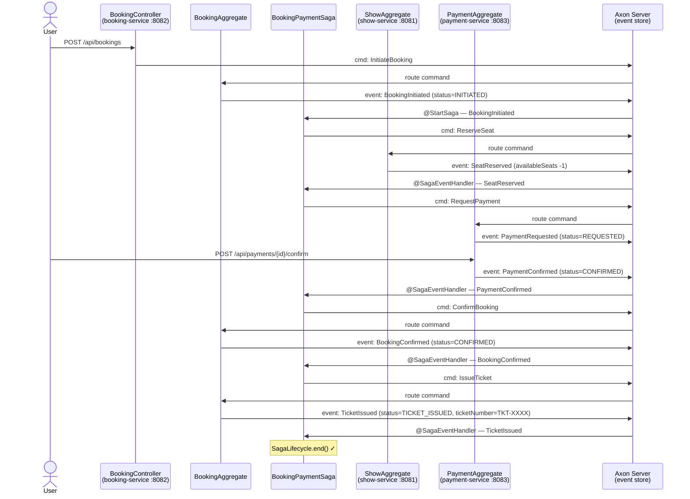
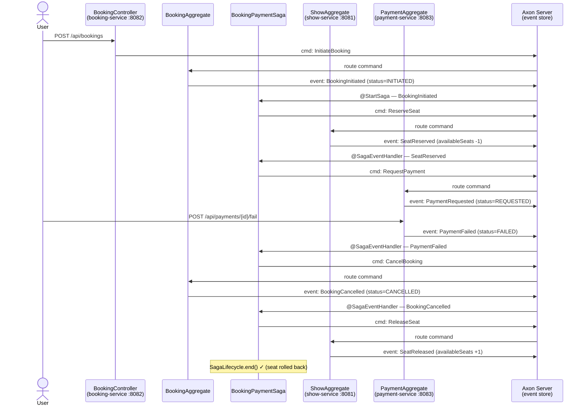
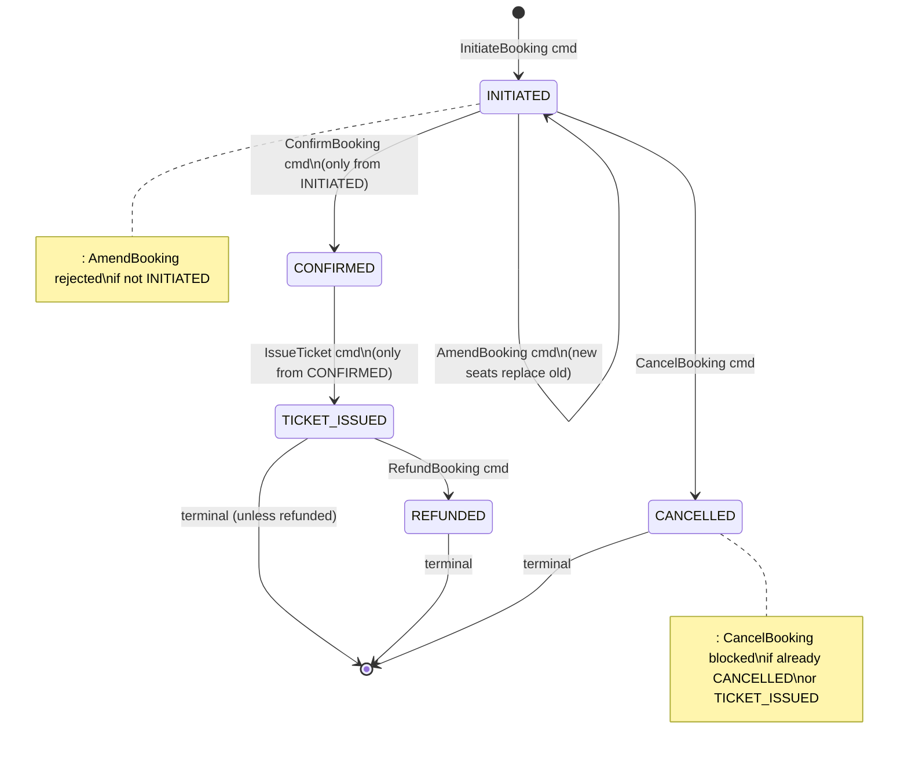
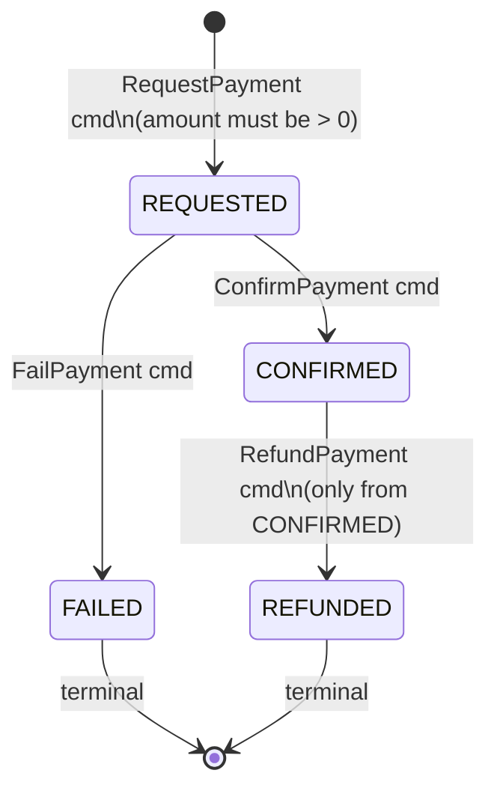
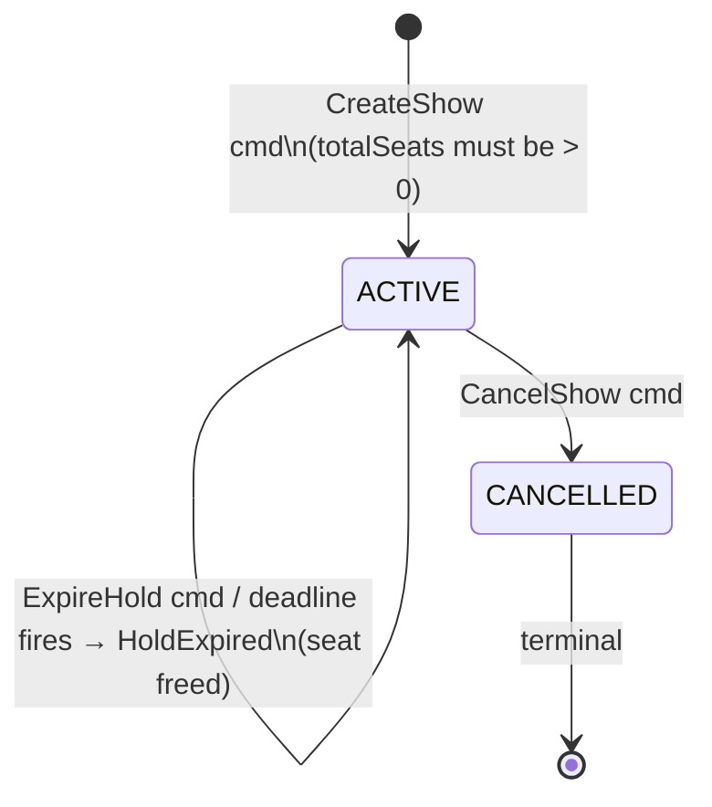
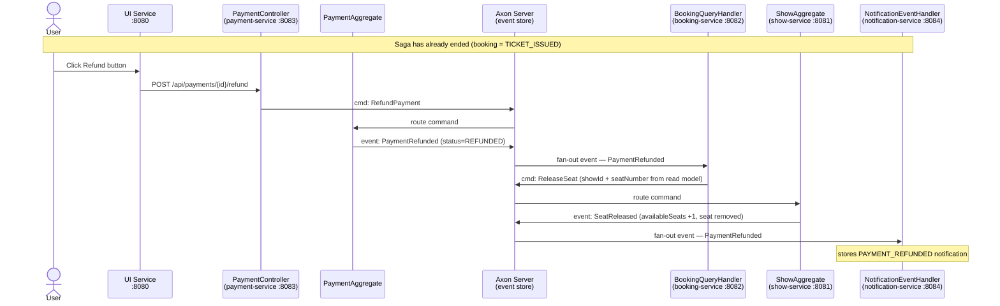
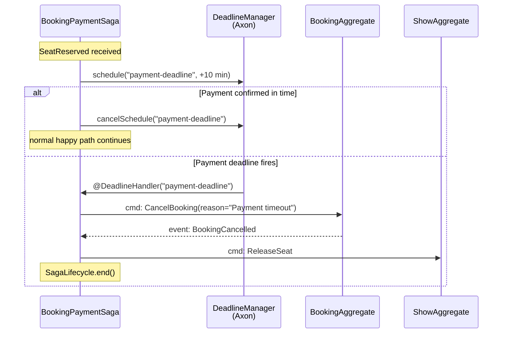
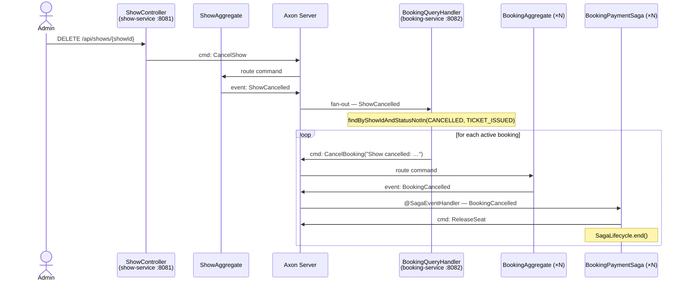
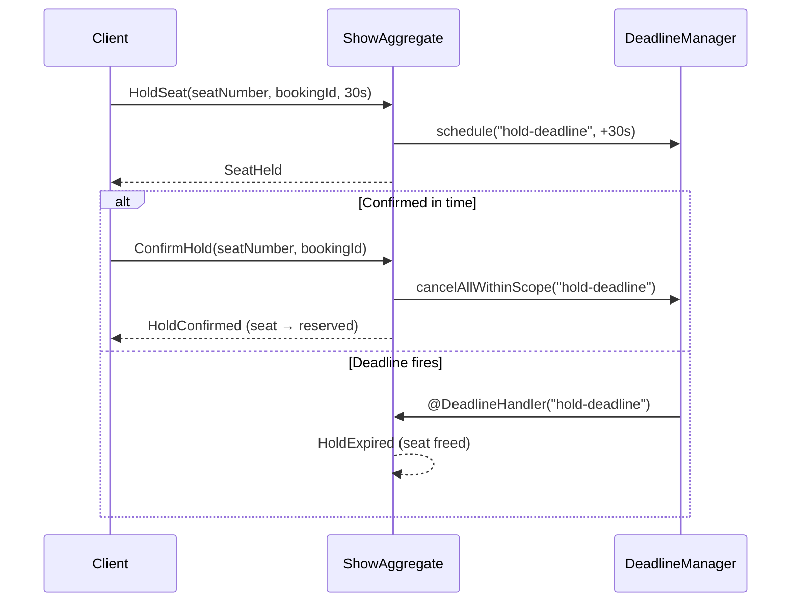

# Ticket Booking — Event Flow Reference

> Render with: GitHub · VS Code (Mermaid Preview extension) · https://mermaid.live

---

## 1. Happy Path — Booking Confirmed & Ticket Issued



---

## 2. Failure Path — Payment Failed & Seat Released



---

## 3. BookingAggregate — State Machine



---

## 4. PaymentAggregate — State Machine



---

## 5. ShowAggregate — State Machine



---

## 6. Refund Flow — Post-Saga (after Ticket Issued)



---

## 7. Service Architecture & Command/Event Routing

```mermaid
flowchart TD
    UI[UI Service\n:8080]
    AS[(Axon Server\n:8124 gRPC\n:8024 HTTP)]

    subgraph booking-service :8082
        BC[BookingController]
        BA[BookingAggregate]
        Saga[BookingPaymentSaga]
        BQ[BookingQueryHandler\nread model → H2]
    end

    subgraph show-service :8081
        SC[ShowController]
        SA[ShowAggregate]
        SQ[ShowQueryHandler\nread model → H2]
    end

    subgraph payment-service :8083
        PC[PaymentController]
        PA[PaymentAggregate]
        PQ[PaymentQueryHandler\nread model → H2]
    end

    subgraph notification-service :8084
        NQ[NotificationEventHandler\nread model → H2]
    end

    UI -->|REST| BC
    UI -->|REST| SC
    UI -->|REST| PC

    BC -->|InitiateBooking cmd| AS
    AS -->|route cmd| BA
    BA -->|BookingInitiated event| AS
    AS -->|fan-out event| Saga
    AS -->|fan-out event| BQ

    Saga -->|ReserveSeat cmd| AS
    AS -->|route cmd| SA
    SA -->|SeatReserved event| AS
    AS -->|fan-out event| Saga
    AS -->|fan-out event| SQ

    Saga -->|RequestPayment cmd| AS
    AS -->|route cmd| PA
    PA -->|PaymentRequested event| AS
    AS -->|fan-out event| PQ

    PC -->|ConfirmPayment cmd| AS
    AS -->|route cmd| PA
    PA -->|PaymentConfirmed event| AS
    AS -->|fan-out event| Saga
    AS -->|fan-out event| PQ

    Saga -->|ConfirmBooking / IssueTicket cmds| AS
    AS -->|route cmds| BA
    BA -->|BookingConfirmed / TicketIssued events| AS
    AS -->|fan-out events| BQ
    AS -->|fan-out events| NQ

    PC -->|RefundPayment cmd| AS
    AS -->|route cmd| PA
    PA -->|PaymentRefunded event| AS
    AS -->|fan-out event| BQ
    BQ -->|ReleaseSeat cmd| AS
    AS -->|route cmd| SA
    AS -->|fan-out event| NQ
```



---

## 8. Quick Reference — Commands & Events per Service

| Service | Commands handled | Events published | Events consumed |
|---------|-----------------|-----------------|-----------------|
| **show-service** | `CreateShow` `ReserveSeat` `ReleaseSeat` `CancelShow` `HoldSeat` `ConfirmHold` `ExpireHold` | `ShowCreated` `SeatReserved` `SeatReleased` `ShowCancelled` `SeatHeld` `HoldConfirmed` `HoldExpired` | — |
| **booking-service** | `InitiateBooking` `ConfirmBooking` `CancelBooking` `IssueTicket` `RefundBooking` `AmendBooking` | `BookingInitiated` `BookingConfirmed` `BookingCancelled` `TicketIssued` `BookingRefunded` `BookingAmended` | `SeatReserved` `PaymentConfirmed` `PaymentFailed` `PaymentRefunded` `ShowCancelled` |
| **booking-query-service** | *(read model — dispatches `CancelBooking` `RefundBooking` `ReleaseSeat` in response to events)* | *(none)* | `BookingInitiated` `BookingConfirmed` `BookingCancelled` `TicketIssued` `BookingRefunded` `BookingAmended` `PaymentRefunded` `ShowCancelled` |
| **payment-service** | `RequestPayment` `ConfirmPayment` `FailPayment` `RefundPayment` | `PaymentRequested` `PaymentConfirmed` `PaymentFailed` `PaymentRefunded` | — |
| **notification-service** | *(none — read only)* | *(none)* | `BookingConfirmed` `BookingCancelled` `TicketIssued` `PaymentRefunded` `BookingAmended` |

---

## 9. Saga Association Keys

The saga uses two association properties to correlate events across services:

| Property | Set when | Used to receive |
|----------|----------|-----------------|
| `bookingId` | `@StartSaga` on `BookingInitiated` | `SeatReserved` · `BookingConfirmed` · `BookingCancelled` · `TicketIssued` |
| `paymentId` | `SagaLifecycle.associateWith()` after `SeatReserved` | `PaymentConfirmed` · `PaymentFailed` |

---

## 10. Auth & Role Rules (UI Service Gateway)

All requests to `/proxy/**` pass through the UI service which validates a JWT and enforces roles.

### Seeded users
| Username | Password | Role |
|---|---|---|
| `admin` | `admin123` | ADMIN |
| `customer` | `customer123` | CUSTOMER |
| `customer2` | `customer123` | CUSTOMER |

### Role permissions

| Action | ADMIN | CUSTOMER |
|---|---|---|
| `POST /proxy/shows` | ✅ | ❌ 403 |
| `DELETE /proxy/shows/{id}` | ✅ | ❌ 403 |
| `POST /proxy/payments/{id}/confirm` | ✅ | ❌ 403 |
| `POST /proxy/payments/{id}/fail` | ✅ | ❌ 403 |
| `POST /proxy/bookings` | ✅ | ✅ (customerId forced to JWT username) |
| `POST /proxy/payments/{id}/refund` | ✅ | ✅ own bookings only |
| `GET /proxy/bookings/customer/{id}` | ✅ any | ✅ own ID only |
| All GET (shows, bookings, payments, notifications) | ✅ | ✅ |

### Ownership enforcement (CUSTOMER role)
- **Create booking** — `customerId` in the request body is silently overridden with the JWT username; the customer cannot book as someone else
- **Refund payment** — proxy fetches the payment → booking → checks `booking.customerId == JWT username`; returns 403 if mismatched
- **List bookings** — `/proxy/bookings/customer/{id}` returns 403 if `id` does not match JWT username

---

## 11. Seat Reservation Timeout (Axon Deadline)

After a seat is reserved the saga schedules a `payment-deadline`. If the customer does not confirm payment before it fires, the booking is cancelled and the seat is released automatically.



**Configuration** (`application-dev.yml` / `application-prod.yml`):
```yaml
booking:
  payment-timeout-minutes: 10   # override with PAYMENT_TIMEOUT_MINUTES env var in prod
```

---

## 12. Show Date & Time

Every show now carries an `eventDate` (ISO-8601 `LocalDateTime`).

### Data model additions
| Layer | Field | Type |
|-------|-------|------|
| `ShowCommands.CreateShow` | `eventDate` | `LocalDateTime` |
| `ShowEvents.ShowCreated` | `eventDate` | `LocalDateTime` |
| `ShowProjection` (read model) | `event_date` | `TIMESTAMP` (included in `V1__initial_schema.sql`) |
| `ShowResponse` (REST) | `eventDate` | ISO-8601 string |
| `CreateShowRequest` (REST) | `eventDate` | ISO-8601 string |

### Seeded demo shows
| Show ID | Title | Event Date |
|---------|-------|-----------|
| `show-001` | Hamilton | 2026-04-15 19:30 |
| `show-002` | The Lion King | 2026-05-20 18:00 |
| `show-003` | Phantom of the Opera | 2026-06-10 20:00 |

The UI "Create Show" modal includes a `datetime-local` input; show cards display the date when present.

---

## 13. Flyway Migration Map (prod PostgreSQL)

Each service runs Flyway against its own PostgreSQL database on startup (`flyway.enabled=true`, `ddl-auto=validate`). All incremental scripts have been **squashed into a single `V1__initial_schema.sql`** per service, capturing the final schema state directly.

| Service | Migration | Tables created |
|---------|-----------|----------------|
| show-service | `V1__initial_schema.sql` | `shows`, `show_reserved_seats`, `dead_letter_entry`, `token_entry`, `saga_entry`, `association_value_entry`, `domain_event_entry`, `snapshot_event_entry` |
| booking-service | `V1__initial_schema.sql` | `bookings`, `dead_letter_entry`, `token_entry`, `saga_entry`, `association_value_entry`, `domain_event_entry`, `snapshot_event_entry` |
| booking-query-service | `V1__initial_schema.sql` | `bookings` (with `created_at`/`updated_at`), `dead_letter_entry`, `token_entry`, `domain_event_entry`, `snapshot_event_entry` |
| payment-service | `V1__initial_schema.sql` | `payments` (`payment_id VARCHAR(100)`), `dead_letter_entry`, `token_entry`, `saga_entry`, `association_value_entry`, `domain_event_entry`, `snapshot_event_entry` |
| notification-service | `V1__initial_schema.sql` | `notifications`, `dead_letter_entry`, `token_entry`, `saga_entry`, `association_value_entry`, `domain_event_entry`, `snapshot_event_entry` |
| ui-service | `V1__create_users_table.sql` | `users` |

**Note**: `token_entry`, `saga_entry`, and `association_value_entry` are Axon Framework JPA entities. In dev (H2, `ddl-auto=create-drop`) Hibernate creates them automatically. In prod (`ddl-auto=validate`) they must exist before the application starts — hence the Flyway migrations.

---

## 14. Show Cancellation Cascade

When a show is cancelled, `BookingQueryHandler` in booking-service listens to `ShowCancelled` and dispatches `CancelBooking` for every booking that is not already in a terminal state (`CANCELLED` or `TICKET_ISSUED`).



Bookings already in `TICKET_ISSUED` are not touched (payment for a confirmed ticket would need a separate refund flow).

---

## 15. Input Validation Rules

All REST endpoints validate request bodies using Bean Validation (`jakarta.validation`). Invalid requests return **400 Bad Request** before any command is dispatched.

| Endpoint | Field | Rule |
|----------|-------|------|
| `POST /api/shows` | `title` | `@NotBlank` |
| `POST /api/shows` | `venue` | `@NotBlank` |
| `POST /api/shows` | `totalSeats` | `@Positive` (> 0) |
| `POST /api/shows` | `ticketPrice` | `@NotNull @Positive` |
| `POST /api/shows` | `eventDate` | `@NotNull @Future` (must be a future date) |
| `POST /api/bookings` | `showId` | `@NotBlank` |
| `POST /api/bookings` | `seatNumber` | `@NotBlank` |
| `POST /api/bookings` | `customerId` | `@NotBlank` |
| `POST /api/bookings` | `amount` | `@NotNull @Positive` |
| `POST /api/payments` | `bookingId` | `@NotBlank` |
| `POST /api/payments` | `customerId` | `@NotBlank` |
| `POST /api/payments` | `amount` | `@NotNull @Positive` |

The UI enforces these same rules client-side (disabled submit, `min` on datetime-local, SOLD OUT options disabled).

---

## 16. Idempotency Guard — Duplicate Seat Booking

`BookingController` rejects a second booking for the same `showId + seatNumber` combination if a non-CANCELLED booking already exists in the read model. This is a synchronous guard executed before the command is dispatched.

```
POST /api/bookings  { showId: "show-001", seatNumber: "A1", ... }
    │
    ▼ BookingRepository.findByShowIdAndSeatNumberAndStatusNot("show-001", "A1", "CANCELLED")
    │
    ├── result not empty  →  409 Conflict  (no command dispatched)
    └── result empty      →  dispatch InitiateBooking  →  202 Accepted
```

**Why**: Without this guard, two concurrent requests could both pass the show-level seat check before either projection is updated, creating two conflicting bookings for the same seat.

---

## 17. Saga Error Recovery & Dead Letter Queue

### .exceptionally() handlers

Every `commandGateway.send()` in the saga wraps failures with `.exceptionally()` so a failed downstream call can never leave a booking stuck in `INITIATED` forever:

| Failing command | Recovery action |
|-----------------|-----------------|
| `ReserveSeat` fails | `CancelBooking("Seat reservation failed: …")` dispatched |
| `RequestPayment` fails | `CancelBooking("Payment request failed: …")` dispatched |
| `ReleaseSeat` fails (in BookingCancelled handler) | Error logged; saga still ends cleanly |

### Dead Letter Queue (DLQ)

Each service registers a `JpaSequencedDeadLetterQueue` for its projection processing group. When an event handler throws an exception that is not retried successfully, the failed event is stored in the `dead_letter_entry` table instead of blocking the entire event processor.

| Service | Processing group | DLQ table |
|---------|-----------------|-----------|
| booking-service | `booking-projections` | `dead_letter_entry` |
| show-service | `show-projections` | `dead_letter_entry` |
| payment-service | `payment-projections` | `dead_letter_entry` |
| notification-service | `notification-projections` | `dead_letter_entry` |

Dead letters can be inspected and retried via the Axon Server UI or programmatically.

### Retry-before-DLQ policy

Each service registers a `RetryingListenerErrorHandler` on its projection processing group. Before a failed event is written to the DLQ, the handler retries it up to **3 times** with exponential back-off:

| Attempt | Wait before retry |
|---------|------------------|
| 1 | 500 ms |
| 2 | 1 000 ms |
| 3 | 2 000 ms |

Only after all three retries fail is the exception re-thrown and the event routed to the DLQ. This absorbs transient failures (e.g., brief DB unavailability) without polluting the dead-letter queue.

### Deadline Recovery on Restart

The saga uses `AxonServerDeadlineManager` (when connected to Axon Server) instead of `SimpleDeadlineManager`. This means the 10-minute payment deadline is persisted in Axon Server and **survives a booking-service restart** — a restarted service will still fire the deadline on time.


---

## 18. CORS Configuration

The ui-service enforces Cross-Origin Resource Sharing (CORS) via Spring Security so that browsers can only call the API from explicitly allowed origins.

### Configuration

| Property | Dev default | Prod override |
|---|---|---|
| `app.allowed-origins` | `http://localhost:8080` | `${ALLOWED_ORIGINS}` env var |
| Allowed methods | GET, POST, DELETE, OPTIONS | same |
| Allowed headers | Authorization, Content-Type | same |
| Allow credentials | false (JWT in header, not cookies) | same |
| Preflight max-age | 3600 s | same |

### How it works

1. Spring Security processes the CORS preflight (`OPTIONS`) before any authentication filter.
2. If the request `Origin` is in `app.allowed-origins`, Spring sets the `Access-Control-Allow-Origin` response header and returns 200.
3. If the origin is **not** allowed, no `Access-Control-Allow-Origin` header is set — the browser blocks the request.
4. For actual (non-preflight) requests, the same origin check applies; disallowed origins get no CORS headers and the browser refuses to expose the response.

### Prod deployment

Set the `ALLOWED_ORIGINS` environment variable to a comma-separated list of your production front-end URLs, e.g.:

```
ALLOWED_ORIGINS=https://tickets.example.com,https://www.tickets.example.com
```

---

## 19. Circuit Breaker — Proxy Resilience

The `ui-service` wraps every outbound call to a downstream service in a Resilience4j circuit breaker. This prevents cascading failures: when a downstream service is unhealthy the circuit opens immediately and subsequent requests are short-circuited with a `503 Service Unavailable` — without waiting for connection timeouts on every call.

### Circuit breaker instances

| Instance | Protects | Base config |
|---|---|---|
| `show-service` | All `/proxy/shows/**` calls | `default` |
| `booking-service` | All `/proxy/bookings/**` calls | `default` |
| `payment-service` | All `/proxy/payments/**` calls | `default` |
| `notification-service` | All `/proxy/notifications/**` calls | `default` |

### Shared `default` configuration

| Property | Value | Meaning |
|---|---|---|
| `sliding-window-size` | 10 | Evaluate the last 10 calls when computing the failure rate |
| `failure-rate-threshold` | 50 % | Open the circuit when ≥ 50 % of the window are failures |
| `wait-duration-in-open-state` | 30 s | Stay OPEN for 30 seconds before moving to HALF_OPEN |
| `permitted-number-of-calls-in-half-open-state` | 3 | Allow 3 probe calls in HALF_OPEN to decide recovery |
| `ignore-exceptions` | `HttpClientErrorException` | 4xx responses from downstream are **not** counted as failures |

### State transitions

```
          ┌──────────────────────────────────────────────────────────────────┐
          │                                                                  │
          ▼                      failure rate ≥ 50 %                        │
       CLOSED  ─────────────────────────────────────────────────────►  OPEN │
          ▲                                                              │   │
          │                                                   30s wait   │   │
          │             probes pass                               ▼       │   │
          └─────────────────────────────────────────────  HALF_OPEN      │   │
                                                              │           │   │
                                                 probes fail  └───────────┘   │
                                                                               │
          All new calls while OPEN → 503 immediately ◄──────────────────────┘
```

- **CLOSED** — normal operation; calls pass through and outcomes are recorded.
- **OPEN** — circuit is tripped; calls are rejected immediately with HTTP 503 and the message `"<service> is temporarily unavailable — circuit open"`. No call reaches the downstream service.
- **HALF_OPEN** — after the 30-second wait, 3 probe calls are allowed through. If they succeed the circuit returns to CLOSED; if they fail it goes back to OPEN.

### 4xx errors are not failures

`HttpClientErrorException` (HTTP 400–499) is listed in `ignore-exceptions`. A 404 Not Found or 422 Unprocessable Entity from a downstream service is a valid business response, not a sign of infrastructure failure, so it does not increment the failure counter and cannot open the circuit.

### 30-second open window

When the circuit opens, `wait-duration-in-open-state: 30s` means the service has half a minute to recover before probe calls are attempted. This avoids hammering a struggling downstream service while it restarts.
---

## 20. Rate Limiting

Per-IP rate limiting is applied to the public auth endpoints in `ui-service` using [Bucket4j](https://github.com/bucket4j/bucket4j) in-memory token buckets (no external cache required).

### Protected endpoints and limits

| Endpoint | Method | Max requests | Window |
|---|---|---|---|
| `/auth/login` | POST | 5 | 1 minute per IP |
| `/auth/register` | POST | 3 | 1 minute per IP |

All other endpoints are unaffected by this filter.

### Response when limit is exceeded

- HTTP status: **429 Too Many Requests**
- `Retry-After: 60` header (seconds until the bucket refills)
- Body:
  ```json
  {"error":"Too many requests — please try again later"}
  ```

### IP resolution

The filter resolves the client IP in this order:

1. The first value in the `X-Forwarded-For` request header (set by reverse proxies / load balancers)
2. `HttpServletRequest.getRemoteAddr()` as the fallback

This ensures correct per-client limiting when the service runs behind a proxy.

### Implementation notes

- Implemented in `com.workshop.security.RateLimitFilter` (`OncePerRequestFilter`).
- Registered in the Spring Security filter chain **before** `JwtFilter` via `.addFilterBefore(new RateLimitFilter(), UsernamePasswordAuthenticationFilter.class)` in `SecurityConfig`.
- Each endpoint has its own `ConcurrentHashMap<String, Bucket>` keyed by IP address. Buckets use a _greedy_ refill strategy (tokens replenish continuously across the window rather than all at once).
- **Buckets are in-memory and reset on service restart.** For multi-instance production deployments, replace the in-memory maps with a distributed cache such as Redis (Bucket4j supports this via `bucket4j-redis`) or Hazelcast to share bucket state across all instances.

---

## §21 — Refund Cascade

When a payment is refunded, the booking aggregate must be moved to `REFUNDED` state and the reserved seat must be released so it becomes available for future bookings.

### Flow

```
PaymentRefunded (event)
  └─► BookingQueryHandler.on(PaymentRefunded)
        └─► RefundBooking command → BookingAggregate
              └─► BookingRefunded (event)
                    └─► BookingQueryHandler.on(BookingRefunded)
                          ├─► projection status → REFUNDED
                          └─► ReleaseSeat command → show-service
```

### Why the query handler drives the refund

The `BookingPaymentSaga` ends at `TicketIssued` (happy path). By the time a refund is issued, the saga is already closed. Driving the refund from the `BookingQueryHandler` event handler avoids needing a second saga and keeps the refund path consistent with the projection's existing role as the cross-event coordinator (e.g., `ShowCancelled` cascade).

### Aggregate validation

`BookingAggregate.handle(RefundBooking)` only accepts the command when the booking is in `TICKET_ISSUED` state. Any other state (e.g., `CANCELLED`, `INITIATED`) causes an `IllegalStateException`, which is logged as a warning and discarded — the payment-service may publish `PaymentRefunded` even for edge-case payments that never reached ticket issuance.

### New status value

| Status | Meaning |
|---|---|
| `INITIATED` | Booking created, awaiting seat reservation |
| `CONFIRMED` | Payment received |
| `TICKET_ISSUED` | Ticket generated and delivered |
| `CANCELLED` | Booking cancelled (payment failure, timeout, show cancellation) |
| `REFUNDED` | Ticket refunded; seat released back to the show |

### New commands and events

| Artefact | Type | Location |
|---|---|---|
| `BookingCommands.RefundBooking` | Command | `booking-service` |
| `BookingEvents.BookingRefunded` | Event | `booking-service` |

---

## §22 — Server-Side Pagination

All list endpoints now return a `PageResult<T>` envelope instead of a bare JSON array.

### Query parameters

| Parameter | Default | Description |
|---|---|---|
| `page` | `0` | Zero-based page index |
| `size` | `20` | Items per page (max enforced by caller) |

### Response envelope

```json
{
  "content":       [...],
  "totalElements": 42,
  "totalPages":    3,
  "number":        0,
  "size":          20
}
```

### Paginated endpoints

| Service | Endpoint | Notes |
|---|---|---|
| show-service | `GET /api/shows` | All shows |
| show-service | `GET /api/shows/active` | Active shows only |
| booking-service | `GET /api/bookings` | Admin — all bookings |
| booking-service | `GET /api/bookings/customer/{id}` | Bookings by customer |
| booking-service | `GET /api/bookings/show/{id}` | Bookings by show |

### Single-resource endpoints unchanged

`GET /api/shows/{showId}` and `GET /api/bookings/{bookingId}` still return a single object — pagination is not applicable.

---

## §23 — Correlation IDs

Every request across the system carries an `X-Correlation-ID` header so that a single user action can be traced through all five services in the logs.

### How it works

1. **Inbound** — `CorrelationFilter` (`OncePerRequestFilter`) runs on every service before Spring Security. It reads `X-Correlation-ID` from the request header; if absent or blank, it generates a new UUID.
2. **MDC** — The correlation ID is stored in SLF4J's MDC under key `correlationId` for the duration of the request, so every log line from that thread carries `[cid=<id>]`.
3. **Response** — `X-Correlation-ID` is written back to the HTTP response header.
4. **Propagation** — The ui-service `RestTemplate` bean has a `ClientHttpRequestInterceptor` that reads `correlationId` from MDC and adds `X-Correlation-ID` to all outbound proxy calls, so the same ID flows into show-service, booking-service, payment-service, and notification-service.

### Log format (dev)

```
09:15:32.041 INFO  [http-nio-8081-exec-1] [cid=a4f2e1b0-...] c.w.controller.ShowController - ...
```

`cid=none` appears when no correlation ID is in scope (e.g., async background threads).

### Filter placement

`CorrelationFilter` is a `@Component` in every service and is therefore registered by the servlet container **before** Spring Security's filter chain — guaranteeing the MDC value is set before any security or rate-limit processing begins.

---

## §24 — Structured Logging & Docker Compose

### Structured logging

Each service has a `logback-spring.xml` that switches the log format based on the active Spring profile:

| Profile | Format | Example |
|---|---|---|
| `dev` / `local` / default | Human-readable with `[cid=...]` MDC field | `10:05:19.415 INFO [thread] [cid=a4f2...] Logger - msg` |
| `prod` | JSON via `LogstashEncoder` | `{"@timestamp":"...","service":"show-service","correlationId":"a4f2...","traceId":"...","spanId":"...","message":"..."}` |

The following MDC keys are included in every prod JSON log line:

| MDC key | Set by | Purpose |
|---------|--------|---------|
| `correlationId` | `CorrelationFilter` (see §23) | Traces one user action across all services |
| `traceId` | Micrometer Tracing | Distributed trace ID; correlates with Zipkin / Jaeger |
| `spanId` | Micrometer Tracing | Span within the trace; used for Kibana/ELK drill-down |

Each service also injects its own name as a static JSON field (`"service":"<service-name>"`) so logs from multiple containers can be filtered by service in a centralised log aggregator.

**Dependency:** `net.logstash.logback:logstash-logback-encoder:7.4` added to root pom (inherited by all services) and ui-service pom separately.

### Docker Compose

`docker-compose.yml` at the workspace root brings up the complete system with a single command:

```bash
# Build all JARs first
mvn clean package -DskipTests

# Launch the full stack
docker-compose up --build
```

**Services started:**

| Container | Image / Build | Port | Notes |
|---|---|---|---|
| `axon-server` | `axoniq/axonserver:latest` | 8024 (dashboard), 8124 (gRPC) | Standalone mode |
| `postgres` | `postgres:16-alpine` | 5432 | Creates showdb, bookingdb, paymentdb, notificationdb, uidb |
| `show-service` | local build | 8081 | |
| `booking-service` | local build | 8082 | |
| `payment-service` | local build | 8083 | |
| `notification-service` | local build | 8084 | |
| `ui-service` | local build | 8080 | Requires `JWT_SECRET` env var |

**Start-up order:**
1. Postgres (health-checked) + Axon Server (health-checked)
2. Downstream services (all depend on both)
3. ui-service (depends on all four downstream services being healthy)

**Required env var for production:**
```bash
export JWT_SECRET="<min-256-bit secret>"
docker-compose up
```

---

## §25 — Aggregate Snapshots (BookingAggregate)

### Why snapshots

Axon reconstructs aggregate state by replaying every event from the event store. Without snapshots, a booking with many status transitions would replay all of them on every command. Snapshots short-circuit this: Axon loads the most recent snapshot and replays only the events that occurred **after** it.

### Configuration

| Property | Dev | Prod | Description |
|---|---|---|---|
| `booking.snapshot-threshold` | `5` | `50` (env: `SNAPSHOT_THRESHOLD`) | Events between snapshots |

### How it works

1. `SnapshotConfig` defines a `bookingSnapshotTrigger` bean using `EventCountSnapshotTriggerDefinition`.
2. `BookingAggregate` is annotated with `@Aggregate(snapshotTriggerDefinition = "bookingSnapshotTrigger")`.
3. After every N events on a given aggregate instance, Axon's `Snapshotter` serializes the current aggregate state and stores it alongside the event stream.
4. On the next load, Axon reads: `(snapshot payload) + (events after snapshot sequence)` instead of the full history.

### Serialization

Snapshots are serialized via Jackson (same `ObjectMapper` used for events). The `AxonJacksonConfig` sets `PropertyAccessor.FIELD` visibility to `ANY`, so private fields in `BookingAggregate` are accessible without getters.

### Storage

- **Dev** (`axon.axonserver.enabled=false`): snapshots stored in the in-memory Axon event store.
- **Prod** (Axon Server): snapshots stored in Axon Server's event store, persisted across restarts.

---

## §26 — Seat Hold Mechanic (ShowAggregate)

A seat can be temporarily **held** for a booking while payment is being processed. This prevents two users from racing to book the same seat during a brief reservation window.

### Commands & Events

| Command | Event emitted | Notes |
|---------|--------------|-------|
| `HoldSeat(showId, seatNumber, bookingId, durationSeconds)` | `SeatHeld` | Blocked if seat already held or reserved |
| `ConfirmHold(showId, seatNumber, bookingId)` | `HoldConfirmed` → seat moves to reserved | Cancels the hold deadline |
| `ExpireHold(showId, seatNumber, bookingId)` | `HoldExpired` → seat freed | Explicit expiry; also fired by deadline handler |

### Deadline

`HoldSeat` schedules a `hold-deadline` via `DeadlineManager` (injected as a command handler parameter). If `ConfirmHold` is not received before `durationSeconds`, `@DeadlineHandler` fires `HoldExpired` automatically. The deadline is cancelled on `ConfirmHold`.



### Aggregate state

`ShowAggregate` tracks held seats in `Map<String, String> heldSeats` (seatNumber → bookingId). Both `heldSeats` and `reservedSeats` count toward the `totalSeats` capacity check.

---

## §27 — Booking Amendment

A booking in `INITIATED` state can have its seat list swapped before payment is confirmed. Once the booking is `CONFIRMED` (payment received), the amendment window closes.

### Command & Event

| Artefact | Type | Payload |
|---------|------|---------|
| `BookingCommands.AmendBooking` | Command | `bookingId`, `newSeats: List<SeatItem>` |
| `BookingEvents.BookingAmended` | Event | `bookingId`, `showId`, `oldSeats`, `newSeats`, `customerId` |

### Saga reaction

`BookingPaymentSaga.on(BookingAmended)`:
1. Dispatches `ReleaseSeat` for every seat already reserved in the show.
2. Resets its internal seat list to `newSeats` and `seatReservationIndex` to 0.
3. Calls `reserveNextSeat()` to begin re-reserving the new seats in sequence.

The saga stays active — payment processing continues after the amendment.

### Projection reaction

`BookingQueryHandler.on(BookingAmended)` updates the `seats` field and `updatedAt` timestamp in the booking read model.

### REST endpoint

```
POST /api/bookings/{bookingId}/amend
Body: { "newSeats": [ { "seatNumber": "C3", "amount": 49.99 } ] }
```

Proxied via `ui-service` at `POST /proxy/bookings/{bookingId}/amend`.

---

## §28 — Chaos Mode & Payment Resilience

### Chaos mode (payment-service)

An admin-controlled toggle injects random payment failures for resilience testing.

| Endpoint | Role | Description |
|----------|------|-------------|
| `GET /api/admin/chaos` | ADMIN | Returns `{ "chaosEnabled": bool, "failureRate": double }` |
| `POST /api/admin/chaos?enabled=true` | ADMIN | Enables or disables chaos mode |

When chaos is enabled, `PaymentAggregate.handle(ConfirmPayment)` calls `ChaosConfig.shouldFail()`. If it returns `true`, `PaymentFailed` is emitted instead of `PaymentConfirmed`, simulating a random payment processor outage.

**Configuration:**

| Property | Default | Description |
|----------|---------|-------------|
| `payment.chaos.failure-rate` | `0.5` | Probability (0.0–1.0) of a failure when chaos is enabled |

The UI exposes a chaos panel card (visible to ADMIN role only) with an enable/disable toggle.

### SSE Notifications (notification-service)

`NotificationSseService` maintains per-customer SSE connections:

- `GET /api/notifications/stream?customerId=X` — subscribe to a customer's notifications
- `GET /api/notifications/stream` (no customerId) — admin broadcast stream (receives all notifications)
- Connections mapped in `ConcurrentHashMap<String, CopyOnWriteArrayList<SseEmitter>>` keyed by `customerId` (or `"all"` for admin)
- On push, the notification is sent to the customer's own emitters **and** to all `"all"` (admin) emitters

`NotificationEventHandler` handles `BookingAmended` and saves a `BOOKING_AMENDED` notification:

> *"Your booking {id} has been updated with new seat selections."*
